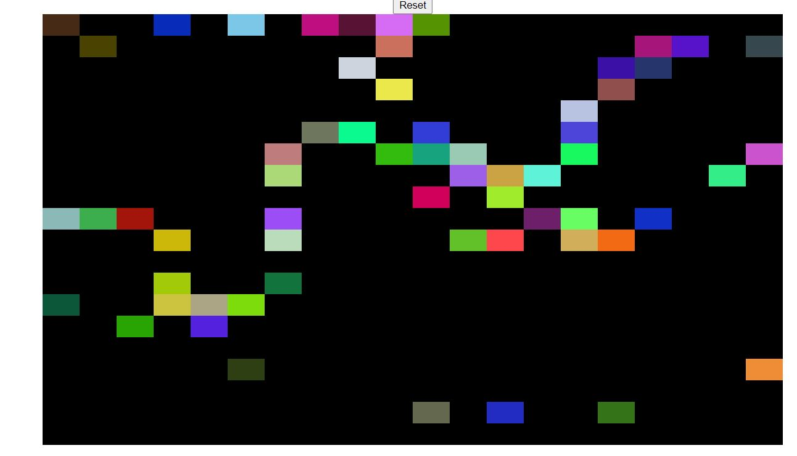

# The Odin Project - Sketch Pad

This is a solution to the [Sketch Pad](https://www.theodinproject.com/paths/foundations/courses/foundations/lessons/etch-a-sketch-project).

## Table of contents

- [Overview](#overview)
  - [The challenge](#the-challenge)
  - [Screenshot](#screenshot)
  - [Links](#links)
- [My process](#my-process)
  - [Built with](#built-with)
- [Author](#author)

## Overview

### The challenge

Users should be able to:

- View the optimal layout depending on their device's screen size
- See the changes on hovering the mouse over the black box

### Screenshot

### Links

- Live Site URL: [Site](https://foolhardy21.github.io/sketchpad/)

## My process

### Built with

- Semantic HTML5 markup
- CSS Grid
- DOM Manipulation

### What I learned

I learnt how DOM Manipulation works from the JS script. I learnt how the elements can be styles from the script itself and I learnt about the CSS Grid.

## Author

- Frontend Mentor - [@foolhardy21](https://www.frontendmentor.io/profile/foolhardy21)
